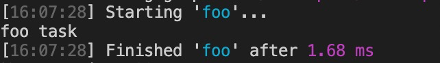
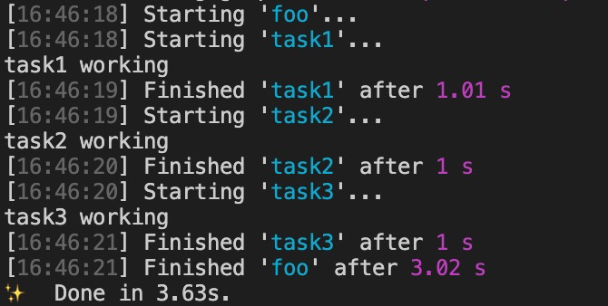
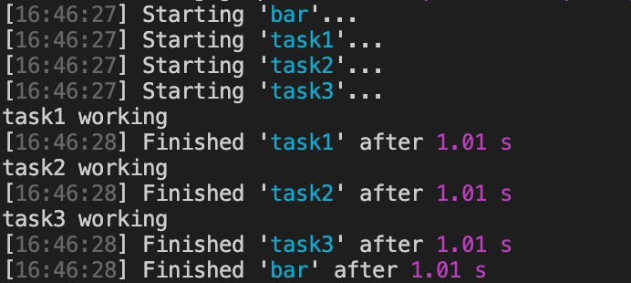

## Gulp

参考：[gulp.js 中文网](https://www.gulpjs.com.cn/) 

## 基本使用

### 安装

```shell
$ yarn add gulp --dev
```

### 创建 gulpfile.js

gulpfile.js 作为 gulp 的入口文件，在这里定义我们需要 gulp 执行的构建任务。

定义构建任务的方式是通过导出函数成员的方式去定义。

当前版本下（4.X）取消了同步代码模式，约定每个任务必须是异步的任务 ，当我们的任务完成后，我们需手动去进行标记。

```js
// gulp 的入口文件

exports.foo = (done) => {
  console.log('foo task')
  done() // 标识任务完成
}

// default 作为默认任务，执行时不需指定任务名
exports.default = (done) => {
  console.log('default task')
  done()
}

// 4.X 版本前，任务定义方式，4.X 版本保留
const gulp = require('gulp')
gulp.task('bar', (done) => {
  console.log('bar task')
  done()
})
```

### 运行

执行命令 `yarn gulp foo`，可以查看结果。



## 组合任务

gulp 提供了 `series` 和  `parallel` 两个，我们可以通过这俩个方法，对任务进行组合。

- `series` 串行任务，任务依次执行
- `parallel` 并行任务，任务同时执行

```js
const { series, parallel } = require('gulp')

const task1 = (done) => {
  setTimeout(() => {
    console.log('task1 working')
    done()
  }, 1000)
}

const task2 = (done) => {
  setTimeout(() => {
    console.log('task2 working')
    done()
  }, 1000)
}

const task3 = (done) => {
  setTimeout(() => {
    console.log('task3 working')
    done()
  }, 1000)
}

exports.foo = series(task1, task2, task3) // 串行任务
exports.bar = parallel(task1, task2, task3) // 并行任务
```

### 结果

`yarn gulp foo`



`yarn gulp bar`



## 异步任务 

可通过以下几种方式，创建异步任务

```js
// 回调函数方式
exports.callback = (done) => {
  console.log('callback task')
  done()
}
// 回调函数方式，通知失败
exports.callback_error = (done) => {
  console.log('callback_error task')
  done(new Error('task fail'))
}

// promise 方式
exports.promise = () => {
  console.log('promise task')
  return Promise.resolve()
}

// promise 方式，通知失败
exports.promise_error = () => {
  console.log('promise_error task')
  return Promise.reject(new Error('task fail'))
}

const timeout = (time) => {
  return new Promise((resolve) => {
    setTimeout(resolve, time)
  })
}

// async 方式，Node 8 以上
exports.async = async () => {
  await timeout(1000)
  console.log('async task')
}

const fs = require('fs')

// stream 方式
exports.stream = () => {
  const readStream = fs.createReadStream('package.json')
  const writeStream = fs.createWriteStream('.env.local')
  readStream.pipe(writeStream)
  // 监听了 stream 的结束
  return readStream
}
```

